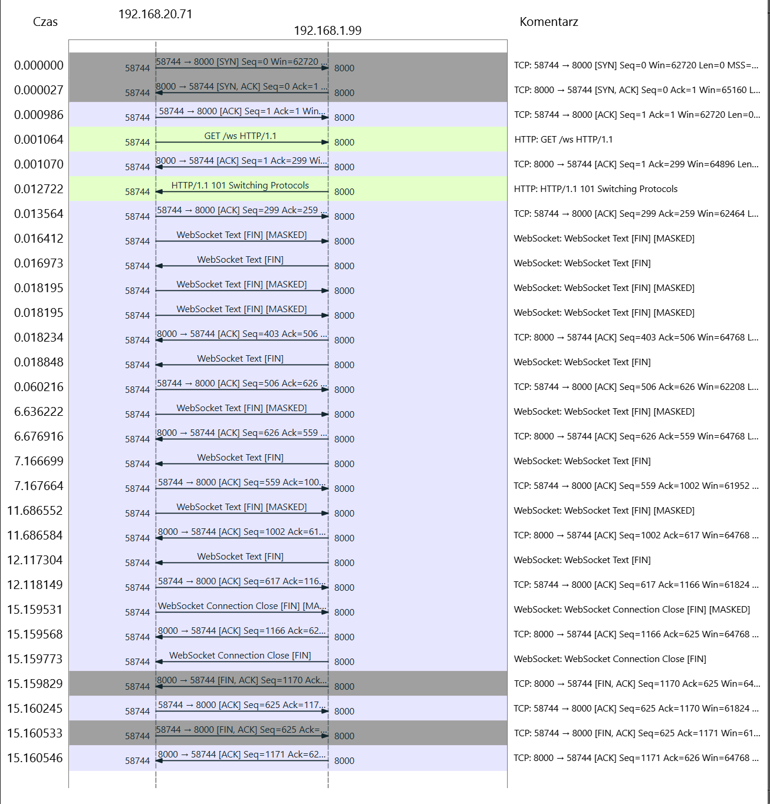

# Message Communication Protocol (MCP) Implementations

This repository demonstrates two implementations of the Model Context Protocol (MCP) by [Anthropic AI](https://www.anthropic.com/news/model-context-protocol), a JSON-RPC based protocol for bi-directional communication that enables developers to build secure, two-way connections between their data sources and AI-powered tools.

## 1. Memory Stream Implementation (run on same host)

### Overview
The Memory Stream implementation demonstrates local client-server communication using in-memory channels. Both client and server operate within the same host.

### Protocol Flow
```
Client                          Server
   |                              |
   |------ initialize() --------->|  (sends capabilities)
   |<---- InitializeResult -------|  (confirms connection)
   |                              |
   |------ list_tools() --------->|
   |<----- tool list -------------|
   |                              |
   |------ call_tool() ---------->|
   |<----- tool result -----------|
```

### Key Components
- **Memory Streams**: Uses `MemoryObjectSendStream` and `MemoryObjectReceiveStream` for message passing
- **JSON-RPC Messages**: Implements standard JSON-RPC 2.0 message format
- **Type Safety**: Utilizes Pydantic models for request/response validation

## 2. WebSocket Implementation

### Overview
The WebSocket implementation extends MCP over network connections using WebSocket protocol. In this demo, it provides weather information services using the National Weather Service API encapsulated via network in WebSocket messages.

### Protocol Flow
```
Client                          Server
   |                              |
   |------ WebSocket Open ------->|
   |<---- Connection Accept ------|
   |                              |
   |------ initialize() --------->|
   |<---- InitializeResult -------|
   |                              |
   |------ list_tools() --------->|
   |<----- weather tools ---------|
```

### Components

1. **Server** (`websocket/server_ws.py`)
```python
@weather_server.list_tools()
async def handle_list_tools():
    return [
        Tool(
            name="get-alerts",
            description="Get active weather alerts for a US state",
            inputSchema={
                "type": "object",
                "required": ["state"],
                "properties": {
                    "state": {
                        "type": "string",
                        "description": "Two-letter state code (e.g. CA, NY)"
                    }
                }
            }
        ),
        Tool(
            name="get-forecast",
            description="Get weather forecast for a location",
            inputSchema={
                "type": "object",
                "required": ["latitude", "longitude"],
                "properties": {
                    "latitude": {
                        "type": "number",
                        "description": "Latitude of the location"
                    },
                    "longitude": {
                        "type": "number",
                        "description": "Longitude of the location"
                    }
                }
            }
        )
    ]
```

2. **Client** (`websocket/client_ws.py`)
```python
client = WebSocketClient("ws://localhost:8000/ws")
await client.connect()
tools = await client.list_tools()
forecast = await client.call_tool("get-forecast", 
    {"latitude": 37.7749, "longitude": -122.4194})
```

### Available Weather Tools
- **get-alerts**: Get active weather alerts for a US state (requires two-letter state code)
- **get-forecast**: Get detailed weather forecast for a location (requires latitude and longitude)


## Setup

### Memory Stream Run (same host via MemoryStream)
```bash
pip install -r requirements.txt
cd memory_stream
python test.py
```

### Websocket Run (client and server on different hosts)
```bash
pip install -r requirements.txt
cd websocket
python test_ws.py
```

Test execution process:
1. Server is started in a separate process
2. System waits 2 seconds to ensure server initialization
3. Client connects and executes test requests via FastAPI WebSocket port 8000
4. Server process is gracefully terminated after tests

To run server client on two machins, you can use `run_server.py` and `run_client.py` script.


## Additional Resources

For a detailed analysis of the client-server communication [port 8000], a PCAP (Packet Capture) file is available in the repository. This capture contains the complete WebSocket conversation between client and server components. This implementation is not encrypted, so the data is transmitted in plain text.
The PCAP file can be opened using Wireshark, a popular network protocol analyzer. It provides a comprehensive view of the communication, including the request headers and their content.

[Download PCAP File](./websocket/pcap/test1.png)

